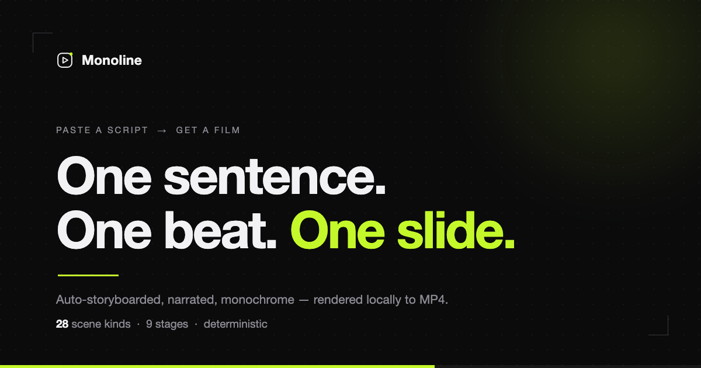

# Monoline



**Paste a script. Get a film.** Monoline is a local, single-user tool that turns a pasted
text script into a finished, narrated explainer video — monochrome, ultra-minimal, no account.

It is not a video editor and not a generative-video model. It is a **pipeline**: your text
becomes structured beats, each beat gets its own voice line and its own layout, and the whole
thing is rendered from HTML to MP4 deterministically. Same input, same film.

## How a job runs

```
paste text  →  outline (review & edit)  →  9 stages  →  MP4  →  Studio (keep editing)
```

1. **Paste or generate a script.** Markdown pasted from a doc, a README or an LLM is parsed
   *by block*, not by source line, so headings, lists, tables and footnote markers do not leak
   onto screen or into the voiceover.
2. **Review the outline before anything is paid for.** The cut into beats and the storyboard
   per beat are shown together; merge, split, delete, reorder, re-type a beat, or attach
   pictures to it. This runs before TTS, so restructuring costs seconds, not a re-render.
3. **Nine stages, each cached.** `script → tts → assemble → plan → fonts → compose → gate →
   render → deliver`. Interrupt it, restart the process, and it resumes where it stopped.
   A re-run never overwrites a storyboard you shaped by hand — `?force=1` repaints, it does
   not re-author.
4. **Then keep editing in Studio**: per-beat narration re-voice, slide text, scene kind,
   layout treatment, drag-reorder (audio follows), keyboard navigation, live preview.

Alignment is deterministic: every line is synthesised separately and its **measured** duration
tiles the timeline. No ASR — Whisper mis-decodes Chinese TTS, which is exactly why this route
was taken.

## Requirements

| | |
|---|---|
| **uv** | Python **3.11** is pinned (kokoro-onnx has no 3.14 wheel) |
| **Node 22** | per `.nvmrc`; resolved by absolute path, other majors are labelled `wrong_version` |
| **ffmpeg + ffprobe** | on `PATH` (`brew install ffmpeg`) |
| **disk** | ~2 GB: Chrome headless shell + Kokoro model + render frame cache |

Nothing phones home. The optional LLM (script writing, per-beat storyboard suggestions) talks
to an OpenAI-compatible endpoint or a local Ollama, and degrades to rules when unconfigured.

## Quick start

```bash
make bootstrap   # uv sync (py3.11) + pnpm install + producer resolve + hyperframes doctor
make start       # build-if-missing → spawn the render sidecar → open http://127.0.0.1:8787
```

`make doctor` prints resolved environment truth. `make help` lists every target.
For hot reload: terminal 1 `make serve`, terminal 2 `pnpm --filter @monoline/web dev`, open `:5173`.

> After editing the SPA, run `pnpm --filter @monoline/web build`. The bundle is served by the
> backend from `backend/src/monoline/static/` and is deliberately **not** part of `make test`.

## Tooling

| Target | What it is |
|---|---|
| `make test` | **the gate**: backend pytest + `tsc --noEmit`. Run this, not an ad-hoc pytest. |
| `make warmup` | renders a built-in fixture end-to-end — the cold-start acceptance test |
| `make doctor` | resolved environment truth (node / ffmpeg / chrome / fonts / sidecar) |
| `make bootstrap` | install everything and verify the render toolchain |
| `make start` | build → spawn sidecar → open the app |

## Layout

```
backend/   Python (uv): FastAPI + pipeline + SQLite + sidecar supervisor   → uv run monoline …
web/       Vite + React + TS (pnpm): monochrome SPA, <hyperframes-player> preview
sidecar/   Node: @hyperframes/producer startServer — a stateless render leaf
design/    tokens shared by the UI and the video composer (4 themes + ui.json)
docs/      CONFIG.md (live surface) · VISUAL.md (ledger) · PLAN.md · ROADMAP.md (frozen)
```

One Python process is the product: it owns the job store, the pipeline, the per-job workspace,
and serves the UI. The Node sidecar is spawned by Python and dies with it. Rendering is
HTML→MP4 via [HyperFrames](https://github.com/heygen-com/hyperframes) (Apache 2.0).

## The invariant

**1 beat ↔ 1 narration segment ↔ 1 scene.** Every stage depends on it, so it is asserted
end-to-end rather than assumed. It is also why "just merge those two slides" is a design
question and not a checkbox.

## Where the docs live

[`docs/README.md`](docs/README.md) explains which file is authoritative and which is frozen.
Short version: `CONFIG.md` is the live surface list (a test compares it against the running app
in both directions), `VISUAL.md` is the version ledger where every row carries the measurement
that justified it, `PLAN.md` holds the current plan plus the **not-doing list** of approaches
already falsified, and `ROADMAP.md` is a frozen V1–V30 narrative whose numbers are not today's.

## Status

Local, single-user, no auth. Counts as of 2026-09-26, `make test` **139 passed**:

**28** scene kinds · **158** inline SVG icons · **25** voices (8 Chinese) · **4** monochrome
themes × **3** layout presets · **3** aspect ratios · mp4 / webm / mov + SRT / VTT + poster
export · bilingual UI (zh / en) · **32** HTTP paths (`GET /openapi.json` is the truth).

- **Editing** outline-first review before TTS, Studio three-pane, per-beat re-voice, drag-reorder,
  a browsable mode library (`#/modes`), per-beat "ask the model for another shape".
- **Visual** whole-piece layout rotation so consecutive beats never repeat a shape; deterministic
  data-viz (rings, bars, donuts, sparklines, KPI, quadrant matrix); diagrams (flow / radial /
  steps / arch / cycle / funnel); image assets with a tone-matched shot treatment; graded
  blur-crossfade and directional transitions; narration-paced reveals; LaTeX via KaTeX.
- **Audio** local Kokoro TTS; background music with narration ducking; punctuation is never spoken.
- **Chinese typography** one owner for on-screen punctuation (GB/T 15834 + clreq), per-kind rules,
  CJK↔latin spacing, edge-only de-bugging so mid-sentence marks survive on screen.

## Third-party

| Component | Licence |
|---|---|
| [HyperFrames](https://github.com/heygen-com/hyperframes) (render engine) | Apache 2.0 |
| [GSAP](https://gsap.com) (animation, vendored) | GSAP Standard License |
| [Kokoro-82M](https://github.com/thewh1teagle/kokoro-onnx) TTS model | per upstream |
| [Noto Sans SC](backend/vendor/fonts/OFL.txt) subset | SIL Open Font License 1.1 |
| [KaTeX](backend/vendor/katex/katex-LICENSE.txt) | MIT |
| [Lucide](backend/vendor/lucide/LICENSE-ISC.txt) icons | ISC |

The licence for Monoline's own code has not been chosen yet; until it is, all rights are
reserved by the author.

---

## 中文

**贴一段文字，出一条片子。** Monoline 是一个纯本地、单机的工具：把你贴进来的文稿变成一条
带旁白的说明视频，单色极简，不需要账号，不联网。

它不是剪辑器，也不是生成式视频模型，而是一条**管线**：文稿被切成节拍，每一拍拿到自己的
配音和自己的版式，最后由 HTML 确定性地渲染成 MP4 —— 同样的输入，得到同样的片子。

**流程**：贴稿 → **先看大纲**（合并 / 拆分 / 删拍 / 改文字 / 换类形 / 挂图，都在这一步做，
此时还没付 TTS 的成本）→ 九个阶段（`script → tts → assemble → plan → fonts → compose →
gate → render → deliver`，逐阶段缓存，中断后续跑）→ 出片 → Studio 里继续逐拍调整。

**对齐方式**是确定性的：逐句合成、逐句量时长、按测量值铺时间轴，不走 ASR（Whisper 对中文
TTS 会解码成乱码，这正是绕开它的原因）。

**环境**：uv + Python 3.11（锁死，kokoro-onnx 无 3.14 wheel）、Node 22、ffmpeg/ffprobe、
约 2GB 磁盘。**上手**：`make bootstrap` 然后 `make start`，打开 `http://127.0.0.1:8787`。

**当前规模**（2026-09-26 实测，`make test` 139 通过）：28 种画面类形、158 个内联图标、
25 个音色（中文 8 个）、4 套单色主题 × 3 种版式预设、3 种画幅，导出 mp4/webm/mov 与
SRT/VTT 字幕、封面图，界面中英双语。

**文档**：`docs/CONFIG.md` 是对外接口全表（有测试与运行中的应用双向比对，不会悄悄过期）；
`docs/VISUAL.md` 是逐版台账，每一行都带着当初的实测数字；`docs/PLAN.md` 是当前计划与
**不做清单**（已被实测否掉的方向，写下来防止重复建设）；`docs/ROADMAP.md` 是 V1–V30 的
历史叙事，数字为冻结快照，不要当现状引用。

本项目自有代码的许可证尚未选定，在此之前保留所有权利。
